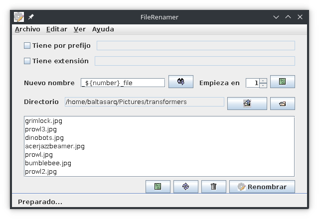

# FileRenamer

**FileRenamer** is a handy tool for renaming files in bulk. It allows multiple name transformations for files in a given directory.

You can check how names are going to be transformed before actually applying renaming.

You can use the following variables in names:

    number: The number of renamed files.
    date: Today's date, in international standard format: yyyy-mm-dd.
    time: Time at the time of renaming: hh_mm_ss.
    name: Previous name of the file.
    namenoext: Previous name of the file, without extension.

You must insert each variable in curly braces, and preceded with a dolar symbol. An example could be:

    ${namenoext}-${date}-${time}

So, for example, the following files:

    IMG-1212211212.jpg
    IMG-2424242424.jpg
    IMG-3232323232.jpg

And the following template:

    img-${date}-${number}.jpg

The result would be:

    img-2018-01-25-1.jpg
    img-2018-01-25-2.jpg
    img-2018-01-25-3.jpg

[Download last release](https://github.com/Baltasarq/FileRenamer/releases "Release").

[Show](https://github.com/Baltasarq/FileRenamer/ "FileRenamer in GitHub") in [GitHub](https://www.github.com/ "GitHub").

&copy; 2011 [baltasarq](http://baltasarq.info/ "baltasarq home") [MIT License](http://www.opensource.org/licenses/MIT "MIT License").
